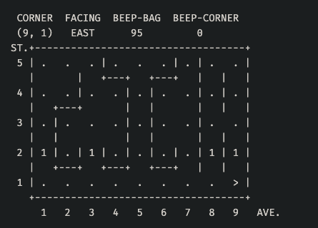
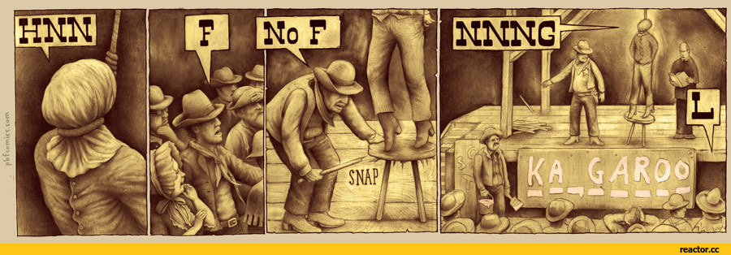
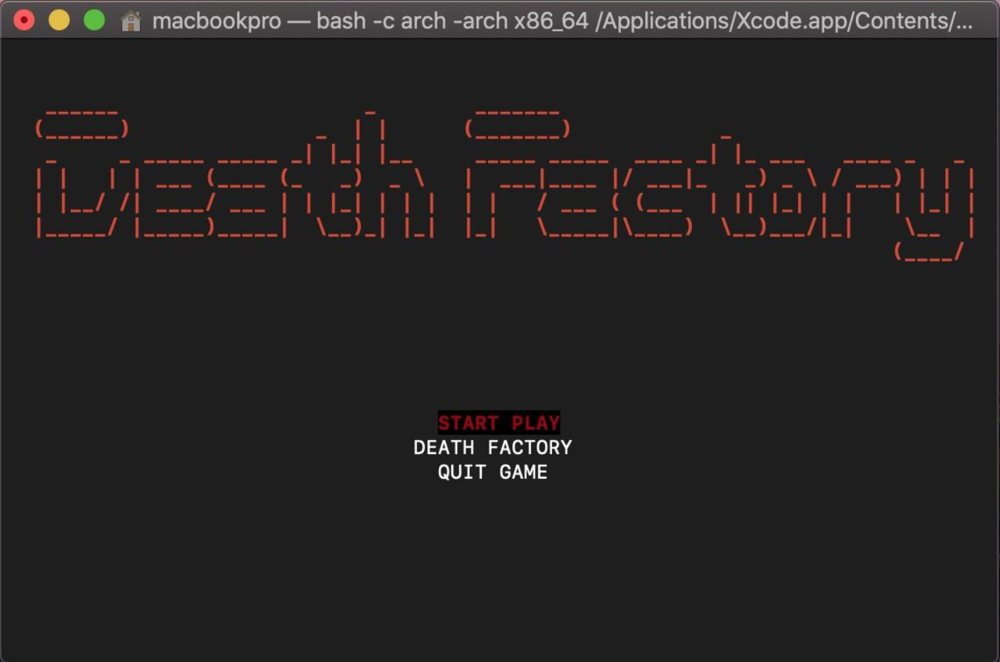
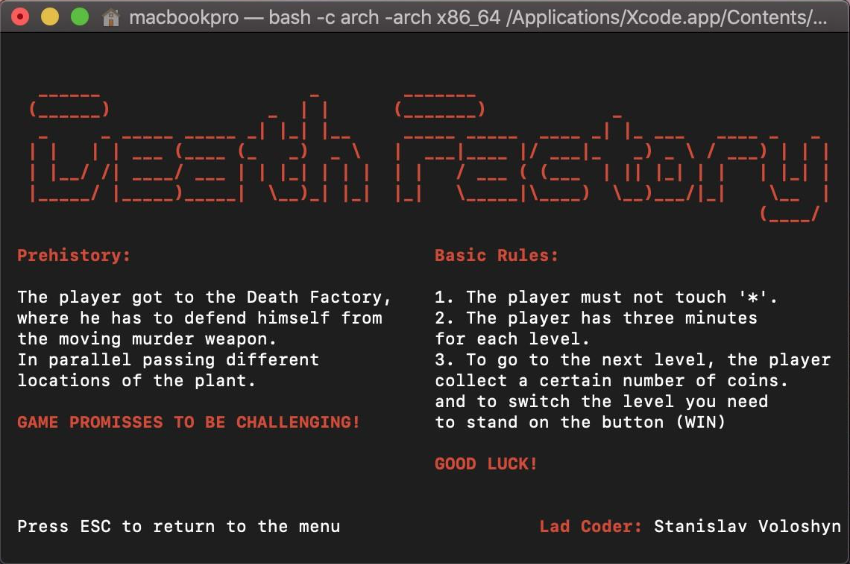
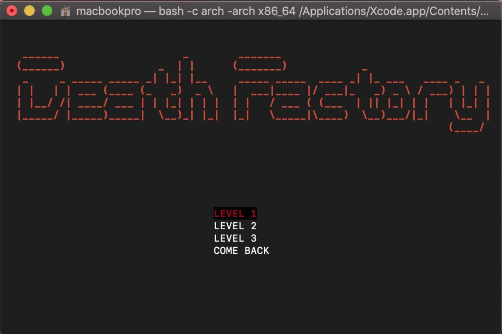
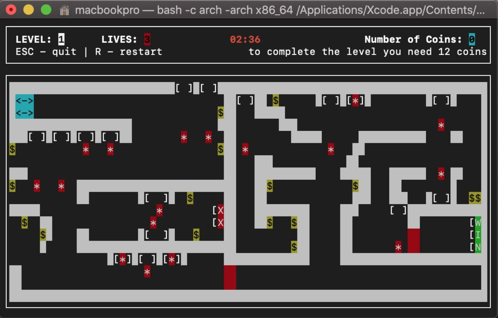

## **C Programming Basics**
                               
* ### **PS1 - Karel the Robot**
  
  
  ### **Karel Language Reference**
  
  ### **Primitives**
  * `void step() - Moves Karel one intersection forward`
  * `void turn_left() - Pivots Karel 90 degrees left`
  * `void pick_beeper() - Takes a beeper from the current intersection and puts it in the beeper bag`
  * `void put_beeper() - Takes a beeper from the beeper bag and puts it at the current intersection`
  * `void turn_on(char* path) - Turns Karel on`
  * `void turn_off() - Turns Karel off`
  
  ### **Sensors**
  * `bool front_is_clear() - Returns true if there is no wall directly in front of Karel. Returns false if there is a wall.`
  * `bool beepers_present() - Returns true if Karel is standing at an intersection that has a beeper, false otherwise`
  * `bool facing_north() - Returns true if Karel is facing north, false otherwise`
  * `bool beepers_in_bag() - Returns true if there is at least one beeper in Karel's beeper bag, false if the beeper bag is empty`
  
  ### **Misc**
  * `void set_step_delay(int) - Sets delay of one Karel's step in miliseconds`
  
  ### **Super Karel Language Reference**
  >**Super Karel is an extension to the basic Karel the Robot library. Super Karel is "equipped" with additional sensors.**
  
  ### **Sensors**
  
  * `bool front_is_blocked() - Returns true if there is a wall directly in front of Karel, false otherwise.`
  * `bool left_is_clear() - Returns true if there is no wall immediately to Karel's left, false if there is`
  * `bool left_is_blocked() - Returns true if there is a wall immediately to Karel's left, false otherwise`
  * `bool right_is_clear() - Returns true if there is no wall immediately to Karel's right, false if there is`
  * `bool right_is_blocked() - Returns true if there is a wall immediately to Karel's right, false otherwise`
  * `bool no_beepers_present() - Returns true if there is not beeper at the current intersection, false if there is a beeper at the current intersection`
  * `bool not_facing_north() - Returns true if Karel is not facing north, false if he is facing north`
  * `bool facing_south() - Returns true if Karel is facing south, false otherwise`
  * `bool not_facing_south() - Returns true if Karel is not facing south, false if he is facing south`
  * `bool facing_east() - Returns true if Karel is facing east, false otherwise`
  * `bool not_facing_east() - Returns true if Karel is not facing east, false if he is facing east`
  * `bool facing_west() - Returns true if Karel is facing west, false otherwise`
  * `bool not_facing_west() - Returns true if Karel is not facing west, false if he is facing west`
  * `bool no_beepers_in_bag() - Returns true if Karel's beeper bag is empty, false if there is at least one beeper in the beeper bag`

* ### **PS2 - Numbers, Arrays**
  > **Practice of working with a mathematical library and arithmetic expressions. 
  Understand how numbers are stored in computer memory. 
  Create your own functions according to the specification. 
  Learn how to complete functions with different return values depending on the input parameters.**

* ### **PS3 - Hangman**

  >**Write your own functions as per specification.
Working with one-dimensional arrays and strings.
Learn to use an array as a parameter in functions.**

  

* ### **PS4 - QR Code**

  > ####Task 1: Encoding a Symbol / Decoding a Symbol
  > ####Task 2: Encode String / Decode String
  > ####Task 3: Encoding Blocks / Decoding Blocks

* ### **PS5 - Files**

  > #### Working with files in C language

* ### **PS6 - Death Factory**

  > #### Original 2d game written in ncurses

  
  
  
  

**Made by **Stanislav Voloshyn** (@.donh)**

  

